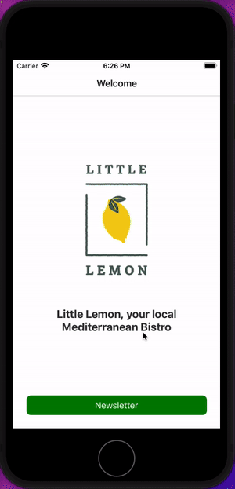

# 📨 Little Lemon – Newsletter Sign-Up App

**Little Lemon Newsletter Sign-Up** is a mobile app built with **React Native** and **Expo**.
It simulates a **simple onboarding flow** where users can subscribe to the fictional Little Lemon newsletter, featuring **smooth screen transitions** and a **clean, minimal UI**.

---

## 🧱 Tech Stack

| Layer      | Technology                |
| ---------- | ------------------------- |
| Framework  | React Native (Expo)       |
| Language   | JavaScript (ES6)          |
| Navigation | React Navigation          |
| Styling    | React Native Stylesheet   |
| Assets     | Custom Little Lemon logos |
| Platform   | Android, iOS, Web         |

---

## 🧪 Features

* ✅ Welcome screen with logo and intro message
* ✅ Subscription screen with **input validation**
* ✅ Screen-to-screen navigation using React Navigation
* ✅ Expo starter configuration for **cross-platform support**
* ✅ Reusable utility functions in `utils/`

---

## 📁 Project Structure

```
Little-Lemon-newsletter-sign-up/
├── assets/                    # App icons, logos, splash screens
│   ├── little-lemon-logo.png
│   └── splash.png
├── navigators/               # Navigation stack setup
│   └── RootNavigator.js
├── screens/                  # App screens
│   ├── WelcomeScreen.js
│   └── SubscribeScreen.js
├── utils/                    # Shared utility functions
│   └── index.js
├── App.js                    # Entry point
├── little_lemon.gif          # Demo animation
├── app.json                  # Expo config
├── package.json              # Dependencies
├── package-lock.json
├── .gitignore
├── LICENSE
└── README.md
```

---

## 🚀 Running Locally

### 1️⃣ Install Dependencies

```bash
npm install
```

### 2️⃣ Start App

```bash
# Start Expo server
npm start

# Or run on specific platforms
npm run android
npm run ios
npm run web
```

> Requires **Expo Go** on mobile or iOS/Android simulator installed.

---

## 🎞 Demo



---

## 📦 Key Dependencies

```json
"expo": "~54.0.23",
"react-native": "0.82.1",
"react": "^19.2.0",
"@react-navigation/native": "^6.0.12",
"@react-navigation/native-stack": "^6.8.0"
```

---

## 👨‍💻 About Me

I'm Ongun Akay, a Senior Full-Stack Developer with expertise across various technologies.

* 👀 Specialize in full-stack development with strong frontend and backend skills
* 🌱 Currently learning advanced web development concepts
* 💞️ Open to exciting collaborations and challenging projects
* 📫 Contact: [info@ongunakay.com](mailto:info@ongunakay.com)

---

## 📄 License

MIT License – See [`LICENSE`](./LICENSE)

---